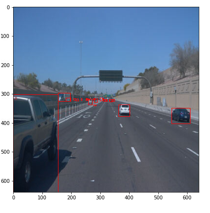
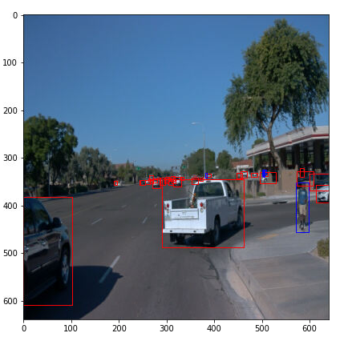

## Submission Template

### Project overview
This project involves applying object detection techniques to detect vehicles and pedestrians in urban environments camera sensor data. The goal is to create a robust and accurate object detection system that can detect and track objects in various scenarios. The project uses the TensorFlow object detection API and involves tasks such as data preparation, model training, and evaluation.

### Dataset

The images in the dataset are annotated with bounding boxes around objects of interest and corresponding labels that identify the type of object. 
The purpose of providing prelabeled ground truth bounding boxes and labels is to train and evaluate object detection models. The models learn to detect objects in new images by analyzing the patterns and features of the annotated images.

### Exploration

Examples of Point Cloud Images: 
<table style="width:100%">
  <tr>
    <td></td>
    <td></td>
  </tr>
  <tr>
    <td></td>
    <td></td>
  </tr>
  <tr>
    <td></td>
    <td></td>
  </tr>
  <tr>
    <td></td>
    <td></td>
  </tr>
  <tr>
    <td></td>
    <td></td>
  </tr>
</table>

### Analysis 
- The following plot shows the distribution of three classes (vehicles, bicycles, and pedestrians) The plot indicates that the dataset is highly unbalanced, with the majority of the vehicle samples, followed by pedestrians and bicycles. The plot also highlights the need for balancing the dataset to prevent any bias towards the overrepresented class during model training.

- The following plot shows the distribution of object frequencies across images in our dataset. As we can see, the majority of images contain vehicles, followed by pedestrians, and then bicycles.

- Upon reviewing the dataset, it appears that there are fewer samples taken in darker or foggy conditions compared to those taken in daylight or clear conditions. In order to address this, introducing random brightness, contrast, and color shifts should prove beneficial.

### Dataset Splits
Dataset splitting is needed for model training to evaluate the performance of the trained model on unseen data. When building a machine learning model, we typically train the model on a subset of the available data, and then evaluate the model on a separate subset of the data that the model has not yet seen. This allows us to estimate how well the model is likely to perform on new, unseen data.

The data you will use for training, validation and testing is organized in the /home/workspace/data/ directory as follows:

- **train**: contain the training data
- **val**: contain the validation data
- **test** - contains 10 files to test your model and create inference videos.

## Training and Evaluation
### Reference Model
The baseline model is first trained and evaluated. Tensorboard is utilized for analyzing the training process, with the training loss of the reference model indicated by the orange line, and the validation loss represented by the red line. While both losses generally decline, the validation loss is significantly higher than the training loss, indicating overfitting of the model.

**Overfitting** refers to a situation in machine learning where a model is trained to fit the training data so closely that it starts to learn the noise and errors present in the data, rather than the underlying patterns that would allow it to generalize to new, unseen data. 

## Improvement

**Data augmentation** can help to avoid overfitting by increasing the diversity and quantity of the training data without collecting new data. By applying random transformations to the existing data, the model is exposed to a wider range of variations in the input data, making it more robust and less likely to overfit to specific patterns in the training set. This allows the model to generalize better to new, unseen data.

The following data augmentation techniques were applied:

- Random pixel value scale
- Random adjust brightness
- Random adjust contrast
- Random adjust hue
- Random distort color
- Random adjust saturation

This shows that the data augmentation techniques helped to improve the model's performance by reducing the total loss. 
The augmented model shows a decrease in both training and validation loss as compared to the reference model. The improvements in the localization and classification losses indicate that the model is making more accurate predictions about the object bounding boxes and labels in the images. The reduction in the regularization loss indicates that the model is less prone to overfitting the training data. Overall, the results demonstrate that data augmentation techniques can be effective in improving the performance of object detection models.